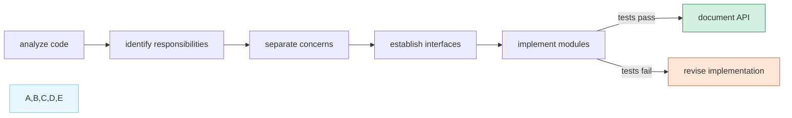
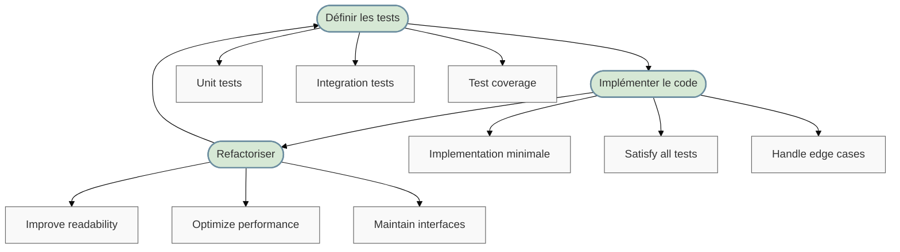
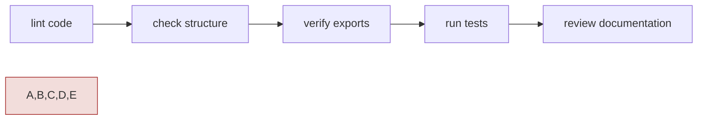
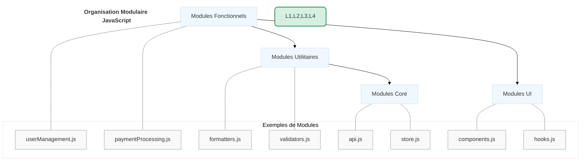
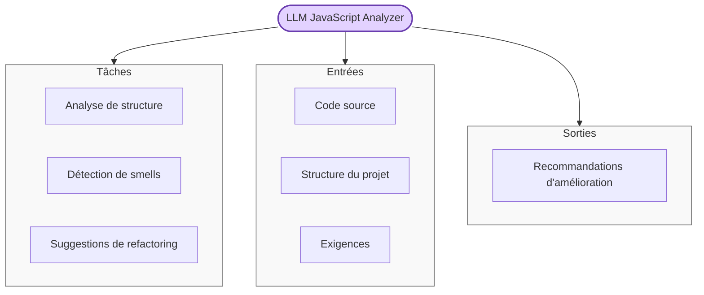
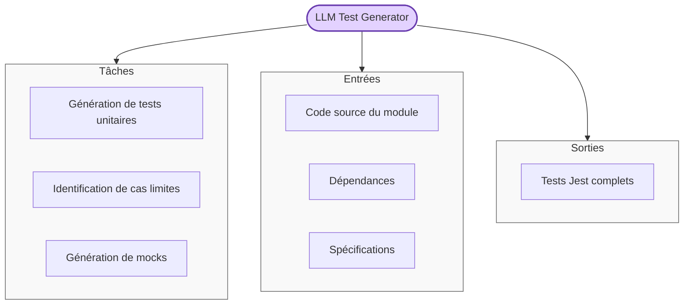
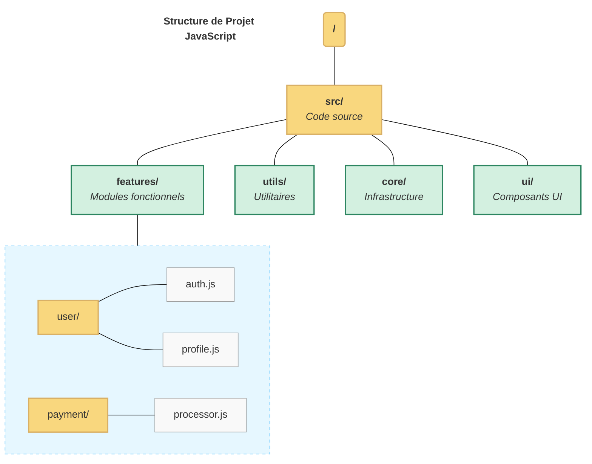

# Documentation de la Règle Example Rule

## 📋 Résumé

La règle `1234-example-rule.mdc` définit les bonnes pratiques pour l'organisation du code JavaScript. Elle établit une méthodologie pour garantir la maintenabilité et la lisibilité du code. Cette règle met l'accent sur la cohérence, la modularité et les tests.

| Aspect               | Description                                                    |
| -------------------- | -------------------------------------------------------------- |
| **Objectif**         | Standardiser l'organisation et la structure du code JavaScript |
| **Applicabilité**    | S'applique à tous les fichiers `**/*.{js,jsx,ts,tsx}`          |
| **Principe central** | Modularité + cohérence + testabilité                           |
| **Format**           | Modules ES6 avec exports nommés                                |
| **Prérequis**        | Comprendre JavaScript ES6+ et les principes SOLID              |

## 🧠 Concepts Fondamentaux

### Module JavaScript Moderne

Un module JavaScript moderne est une unité de code réutilisable qui encapsule des fonctionnalités liées et expose une interface claire. Les modules facilitent la séparation des préoccupations, améliorent la maintenabilité et permettent une meilleure organisation du code.

### Caractéristiques d'un Bon Module

Un module bien conçu présente les caractéristiques suivantes:

1. **Interface claire** - Exports nommés explicites définissant l'API publique
2. **Responsabilité unique** - Se concentre sur une seule préoccupation fonctionnelle
3. **Faible couplage** - Minimise les dépendances avec les autres modules
4. **Testabilité** - Facile à tester de manière isolée
5. **Documentation** - Commentaires JSDoc pour les fonctions exportées
6. **Taille maîtrisée** - Généralement moins de 300 lignes de code

## 🔍 Principes de Base JavaScript

La règle définit trois principes fondamentaux pour tout module JavaScript:

```mermaid
%%{init: {'theme': 'base', 'themeVariables': { 'primaryColor': '#ebf8f1', 'fontSize': '16px'}}}%%
flowchart TD
    title[<b>Les Trois Principes Fondamentaux</b>]
    style title fill:none,stroke:none

    P1(["Modularité"])
    P2(["Cohérence"])
    P3(["Testabilité"])

    P1 --> P1A["Exports nommés"]
    P1 --> P1B["Responsabilité unique"]
    P1 --> P1C["Encapsulation"]

    P2 --> P2A["Conventions de nommage"]
    P2 --> P2B["Structure de fichiers"]
    P2 --> P2C["Style de code"]

    P3 --> P3A["Injection de dépendances"]
    P3 --> P3B["Fonctions pures"]
    P3 --> P3C["Interfaces claires"]

    style P1 fill:#d3f0e0,stroke:#2c8560,stroke-width:2px,color:#333
    style P2 fill:#d8e7ff,stroke:#3d6daf,stroke-width:2px,color:#333
    style P3 fill:#ffe7d8,stroke:#af6d3d,stroke-width:2px,color:#333

    style P1A,P1B,P1C fill:#eafaf2,stroke:#2c8560,stroke-width:1px
    style P2A,P2B,P2C fill:#ebf3ff,stroke:#3d6daf,stroke-width:1px
    style P3A,P3B,P3C fill:#fff4eb,stroke:#af6d3d,stroke-width:1px
```



1. **Modularité**:

   - Préférer les exports nommés pour une API claire
   - Responsabilité unique: chaque module fait une chose bien
   - Encapsulation des détails d'implémentation avec des variables privées

2. **Cohérence**:

   - Conventions de nommage uniformes (camelCase, PascalCase)
   - Structure de fichiers cohérente dans tout le projet
   - Style de code standardisé (via ESLint et Prettier)

3. **Testabilité**:
   - Injection de dépendances pour faciliter les mocks
   - Préférence pour les fonctions pures quand c'est possible
   - Interfaces claires avec des types bien définis

## 🔄 Processus de Refactoring (Ω•refactor•module)

Le processus `Ω•refactor•module` définit une approche systématique pour refactoriser un module JavaScript:



### Étapes du Refactoring

1. **Analyse du code**:

   - Compréhension de la fonctionnalité existante
   - Identification des points de friction et dettes techniques

2. **Identification des responsabilités**:

   - Séparation des préoccupations différentes
   - Regroupement des fonctionnalités liées

3. **Séparation des préoccupations**:

   - Création de modules distincts pour chaque responsabilité
   - Définition des interfaces entre modules

4. **Établissement des interfaces**:
   - Conception d'APIs claires pour chaque module
   - Définition des contrats et types

## 👨‍💻 Workflow de Test TDD (Ω•test•module)

Le workflow `Ω•test•module` définit les étapes pour tester un module JavaScript:



### Détail du Workflow TDD

1. **Définir les tests**:

   - Écrire des tests unitaires pour toutes les fonctions exportées
   - Ajouter des tests d'intégration pour les scénarios complexes
   - Viser une couverture de tests d'au moins 80%

2. **Implémenter le code**:

   - Écrire l'implémentation minimale pour faire passer les tests
   - S'assurer que tous les tests réussissent
   - Gérer les cas limites identifiés par les tests

3. **Refactoriser**:
   - Améliorer la lisibilité sans modifier le comportement
   - Optimiser la performance si nécessaire
   - Maintenir l'interface publique stable

## 🔍 Protocole de Validation (Ω•validate•module)

Le protocole de validation garantit que les modules respectent les standards de qualité:



### Étapes de Validation

1. **Vérification du style**:

   - Exécution de ESLint avec la configuration du projet
   - Vérification du formatage avec Prettier

2. **Vérification de la structure**:

   - Respect de la structure de fichiers du projet
   - Importations organisées et triées

3. **Vérification des exports**:

   - Interface publique claire et bien définie
   - Pas d'exports par défaut sauf exception justifiée

4. **Exécution des tests**:

   - Tests unitaires et d'intégration qui passent
   - Couverture de code suffisante (>80%)

5. **Revue de la documentation**:
   - Documentation JSDoc pour toutes les fonctions exportées
   - README mis à jour si nécessaire

## 📋 Structure du Projet JavaScript

La règle recommande d'organiser les modules selon les principes de fractionnement fonctionnel:



### Les Quatre Types de Modules

1. **Modules Fonctionnels** (`/src/features/`):

   - Implémentent des fonctionnalités métier spécifiques
   - Peuvent combiner UI, logique et API
   - Exemples: `userManagement.js`, `paymentProcessing.js`

2. **Modules Utilitaires** (`/src/utils/`):

   - Fournissent des fonctions réutilisables
   - Indépendants du domaine métier
   - Exemples: `formatters.js`, `validators.js`

3. **Modules Core** (`/src/core/`):

   - Infrastructure fondamentale de l'application
   - Configurent l'environnement et les services globaux
   - Exemples: `api.js`, `store.js`

4. **Modules UI** (`/src/ui/`):
   - Composants d'interface utilisateur réutilisables
   - Hooks et logique de présentation
   - Exemples: `components.js`, `hooks.js`

## 🤖 Délégation au LLM

### LLM Code Analyzer pour JavaScript

La règle définit comment le LLM peut assister dans l'analyse du code JavaScript:



### LLM Test Generator pour JavaScript

La règle définit également comment le LLM peut assister dans la génération de tests:



## 🌲 Arborescence des Fichiers

### Représentation Graphique



### Représentation Textuelle Détaillée

```
/
│
├── src/                                     # CODE SOURCE
│   │
│   ├── features/                            # MODULES FONCTIONNELS - Logique métier
│   │   │
│   │   ├── user/                            # Module utilisateur
│   │   │   ├── auth.js                      # Authentification
│   │   │   └── profile.js                   # Gestion de profil
│   │   │
│   │   └── payment/                         # Module paiement
│   │       └── processor.js                 # Traitement des paiements
│   │
│   ├── utils/                               # UTILITAIRES - Fonctions génériques
│   │   │
│   │   ├── formatters.js                    # Formatage de données
│   │   └── validators.js                    # Validation de données
│   │
│   ├── core/                                # CORE - Infrastructure fondamentale
│   │   │
│   │   ├── api.js                           # Client API
│   │   └── store.js                         # État global
│   │
│   └── ui/                                  # UI - Interface utilisateur
│       │
│       ├── components/                      # Composants réutilisables
│       └── hooks/                           # Hooks personnalisés
│
└── tests/                                   # TESTS
    └── Structure miroir de /src
```

### Convention de Nommage

- **Fichiers modules**: `camelCase.js` (ex: `userAuth.js`)
- **Classes/Composants**: `PascalCase.js` (ex: `UserProfile.js`)
- **Organisation**: `/src/{type}/{domaine}/`

## ⚠️ Contraintes Critiques à Respecter

La règle identifie plusieurs contraintes importantes:

1. **Pas d'export par défaut**:

   - ❌ `export default function doSomething() {...}`
   - ✅ `export function doSomething() {...}`

2. **Éviter les modules monolithiques**:

   - ❌ Fichiers de plus de 300 lignes
   - ✅ Modules ciblés et focalisés

3. **Tout module doit être testé**:

   - ❌ Modules sans tests
   - ✅ Au moins 80% de couverture de tests

4. **Éviter les effets de bord**:

   - ❌ Fonctions qui modifient des variables externes
   - ✅ Fonctions pures qui retournent de nouvelles valeurs

5. **Pas de logique dupliquée**:
   - ❌ Code copié/collé entre modules
   - ✅ Factorisation des fonctionnalités communes

## 📝 Patterns Recommandés

### Organisation de Code

- Un module par fonctionnalité
- Séparation des préoccupations UI/logique métier/data
- Structure de dossiers cohérente

### Patterns Fonctionnels

- Immutabilité des données
- Composition de fonctions
- Gestion d'erreurs avec Result/Either

### Patterns de Modules

- Exports nommés groupés en fin de fichier
- Documentation JSDoc complète
- Tests unitaires automatisés

## ✅ Liste de Vérification

Utilisez cette liste pour valider vos modules JavaScript:

- [ ] Le module a une responsabilité unique et clairement définie
- [ ] Le module n'utilise que des exports nommés (pas d'export default)
- [ ] Le fichier ne dépasse pas 300 lignes de code
- [ ] Tous les exports sont documentés avec JSDoc
- [ ] La couverture de tests est d'au moins 80%
- [ ] Le code respecte les conventions de nommage du projet
- [ ] Le linter ne signale aucune erreur
- [ ] Les dépendances sont explicitement déclarées
- [ ] Pas d'effets de bord non documentés
- [ ] Le module est placé dans la structure de dossiers appropriée

## 📚 Ressources Additionnelles

Pour plus de détails sur les bonnes pratiques JavaScript, consultez:

- `.cursor/kb/1234-example-rule/guidelines/module_patterns.md` - Patterns de modules
- `.cursor/kb/1234-example-rule/guidelines/testing_strategies.md` - Stratégies de test
- `.cursor/kb/1234-example-rule/examples/good_modules.md` - Exemples de bons modules
- `.cursor/kb/1234-example-rule/examples/bad_modules.md` - Anti-patterns à éviter
- [MDN - JavaScript Modules](https://developer.mozilla.org/en-US/docs/Web/JavaScript/Guide/Modules)
- [Clean Code JavaScript](https://github.com/ryanmcdermott/clean-code-javascript)
- [You Don't Know JS](https://github.com/getify/You-Dont-Know-JS)
