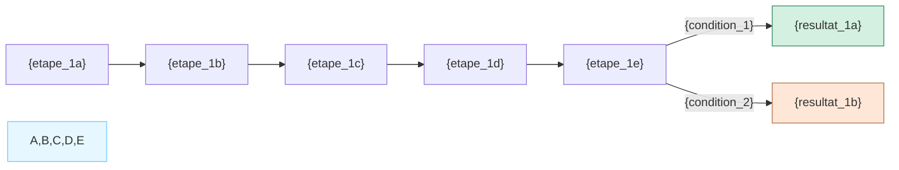
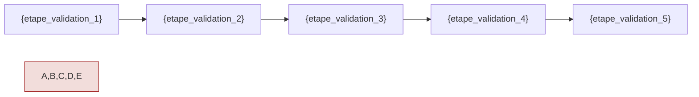
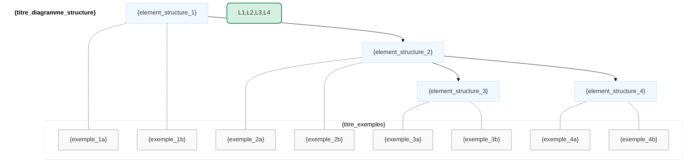
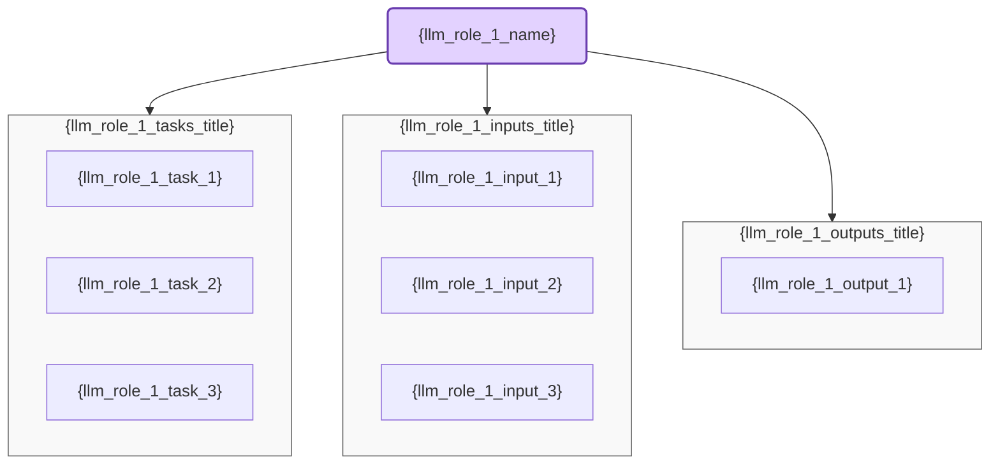
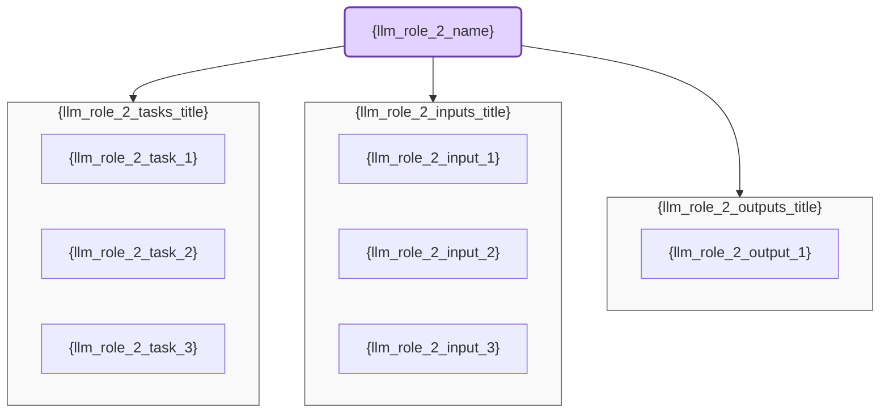
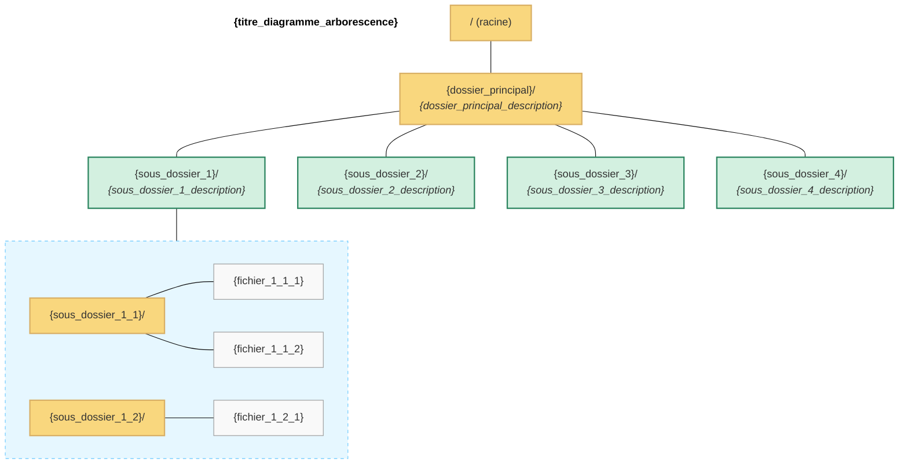

# Documentation de la Règle {rule_name}

## 📋 Résumé

La règle `{rule_id}.mdc` définit {description_courte}. Elle établit {description_valeur_ajoutée}. Cette règle met l'accent sur {principes_clés}.

| Aspect               | Description                                     |
| -------------------- | ----------------------------------------------- |
| **Objectif**         | {objectif_principal}                            |
| **Applicabilité**    | S'applique à tous les fichiers `{glob_pattern}` |
| **Principe central** | {principes_centraux}                            |
| **Format**           | {format_attendu}                                |
| **Prérequis**        | {connaissances_requises}                        |

## 🧠 Concepts Fondamentaux

### {concept_principal}

{explication_du_concept_principal}

### Caractéristiques {caractéristiques_titre}

{liste_caracteristiques_avec_explications}

## 🔍 Principes de Base {nom_domaine}

La règle définit {nombre} principes fondamentaux:

```mermaid
%%{init: {'theme': 'base', 'themeVariables': { 'primaryColor': '#ebf8f1', 'fontSize': '16px'}}}%%
flowchart TD
    title["{titre_diagramme_principes}"]
    style title fill:none,stroke:none,color:black,font-weight:bold

    %% Définir les principes
    P1["{principe_1}"]
    P2["{principe_2}"]
    P3["{principe_3}"]

    %% Définir les sous-principes
    P1 --> P1A["{sous_principe_1a}"]
    P1 --> P1B["{sous_principe_1b}"]
    P1 --> P1C["{sous_principe_1c}"]

    P2 --> P2A["{sous_principe_2a}"]
    P2 --> P2B["{sous_principe_2b}"]
    P2 --> P2C["{sous_principe_2c}"]

    P3 --> P3A["{sous_principe_3a}"]
    P3 --> P3B["{sous_principe_3b}"]
    P3 --> P3C["{sous_principe_3c}"]

    %% Styles
    style P1 fill:#d3f0e0,stroke:#2c8560,stroke-width:2px,color:#333
    style P2 fill:#d8e7ff,stroke:#3d6daf,stroke-width:2px,color:#333
    style P3 fill:#ffe7d8,stroke:#af6d3d,stroke-width:2px,color:#333

    style P1A,P1B,P1C fill:#eafaf2,stroke:#2c8560,stroke-width:1px
    style P2A,P2B,P2C fill:#ebf3ff,stroke:#3d6daf,stroke-width:1px
    style P3A,P3B,P3C fill:#fff4eb,stroke:#af6d3d,stroke-width:1px
```



1. **{principe_1}**:

   - {explication_1a}
   - {explication_1b}
   - {explication_1c}

2. **{principe_2}**:

   - {explication_2a}
   - {explication_2b}
   - {explication_2c}

3. **{principe_3}**:
   - {explication_3a}
   - {explication_3b}
   - {explication_3c}

## 🔄 Processus {nom_processus_1} (Ω•{processus_id_1})

Le processus `Ω•{processus_id_1}` définit {description_processus_1}:



### {sous_titre_processus_1}

1. **{etape_1a_titre}**:

   - {etape_1a_detail_1}
   - {etape_1a_detail_2}

2. **{etape_1b_titre}**:

   - {etape_1b_detail_1}
   - {etape_1b_detail_2}

3. **{etape_1c_titre}**:

   - {etape_1c_detail_1}
   - {etape_1c_detail_2}

4. **{etape_1d_titre}**:
   - {etape_1d_detail_1}
   - {etape_1d_detail_2}

## 👨‍💻 Workflow {nom_processus_2} (Ω•{processus_id_2})

Le workflow `Ω•{processus_id_2}` définit {description_processus_2}:

```mermaid
%%{init: {'theme': 'base', 'themeVariables': { 'primaryColor': '#f0f8ff', 'fontSize': '16px'}}}%%
flowchart TB
    %% Phases principales
    A["{phase_2a}"]
    B["{phase_2b}"]
    C["{phase_2c}"]

    %% Flux principal
    A --> B --> C

    %% Sous-étapes phase A
    A1["{etape_2a1}"]
    A2["{etape_2a2}"]
    A3["{etape_2a3}"]
    A --> A1 & A2 & A3

    %% Sous-étapes phase B
    B1["{etape_2b1}"]
    B2["{etape_2b2}"]
    B3["{etape_2b3}"]
    B --> B1 & B2 & B3

    %% Sous-étapes phase C
    C1["{etape_2c1}"]
    C2["{etape_2c2}"]
    C3["{etape_2c3}"]
    C --> C1 & C2 & C3

    %% Styles
    classDef phase fill:#d6e8d5,stroke:#6c8ea0,stroke-width:2px,color:#333,rx:5
    classDef step fill:#f9f9f9,stroke:#666,stroke-width:1px

    class A,B,C phase
    class A1,A2,A3,B1,B2,B3,C1,C2,C3 step
```



### Détail du Workflow {nom_processus_2}

1. **{phase_2a}**:

   - {phase_2a_detail_1}
   - {phase_2a_detail_2}
   - {phase_2a_detail_3}

2. **{phase_2b}**:

   - {phase_2b_detail_1}
   - {phase_2b_detail_2}
   - {phase_2b_detail_3}

3. **{phase_2c}**:
   - {phase_2c_detail_1}
   - {phase_2c_detail_2}
   - {phase_2c_detail_3}

## 🔍 Protocole de Validation {nom_validation} (Ω•{validation_id})

Le protocole de validation garantit {objectif_validation}:



### Étapes de Validation

1. **{etape_validation_1_titre}**:

   - {etape_validation_1_detail_1}
   - {etape_validation_1_detail_2}

2. **{etape_validation_2_titre}**:

   - {etape_validation_2_detail_1}
   - {etape_validation_2_detail_2}

3. **{etape_validation_3_titre}**:

   - {etape_validation_3_detail_1}
   - {etape_validation_3_detail_2}

4. **{etape_validation_4_titre}**:

   - {etape_validation_4_detail_1}
   - {etape_validation_4_detail_2}

5. **{etape_validation_5_titre}**:
   - {etape_validation_5_detail_1}
   - {etape_validation_5_detail_2}

## 📋 Structure {nom_structure}

La règle recommande {description_structure}:



### {structure_section_titre}

1. **{element_structure_1_titre}** (`{element_structure_1_path}`):

   - {element_structure_1_description_1}
   - {element_structure_1_description_2}
   - {element_structure_1_description_3}

2. **{element_structure_2_titre}** (`{element_structure_2_path}`):

   - {element_structure_2_description_1}
   - {element_structure_2_description_2}
   - {element_structure_2_description_3}

3. **{element_structure_3_titre}** (`{element_structure_3_path}`):

   - {element_structure_3_description_1}
   - {element_structure_3_description_2}
   - {element_structure_3_description_3}

4. **{element_structure_4_titre}** (`{element_structure_4_path}`):
   - {element_structure_4_description_1}
   - {element_structure_4_description_2}
   - {element_structure_4_description_3}

## 🤖 Délégation au LLM

### LLM {llm_role_1} pour {llm_domain_1}

La règle définit comment le LLM peut assister dans {llm_assistance_domain_1}:



### LLM {llm_role_2} pour {llm_domain_2}

La règle définit également comment le LLM peut assister dans {llm_assistance_domain_2}:



## 🌲 Arborescence des Fichiers

### Représentation Graphique



### Représentation Textuelle Détaillée

```
/
│
├── {dossier_principal}/                           # {dossier_principal_description_complete}
│   │
│   ├── {sous_dossier_1}/                          # {sous_dossier_1_description_complete}
│   │   │
│   │   ├── {sous_dossier_1_1}/                    # {sous_dossier_1_1_description}
│   │   │   ├── {fichier_1_1_1}                    # {fichier_1_1_1_description}
│   │   │   └── {fichier_1_1_2}                    # {fichier_1_1_2_description}
│   │   │
│   │   └── {sous_dossier_1_2}/                    # {sous_dossier_1_2_description}
│   │       └── {fichier_1_2_1}                    # {fichier_1_2_1_description}
│   │
│   ├── {sous_dossier_2}/                          # {sous_dossier_2_description_complete}
│   │   │
│   │   └── {sous_dossier_2_fichiers_description}
│   │
│   ├── {sous_dossier_3}/                          # {sous_dossier_3_description_complete}
│   │   │
│   │   └── {sous_dossier_3_fichiers_description}
│   │
│   └── {sous_dossier_4}/                          # {sous_dossier_4_description_complete}
│       │
│       └── {sous_dossier_4_fichiers_description}
│
└── {dossier_tests}/                               # {dossier_tests_description}
    └── {structure_tests_description}
```

### Convention de Nommage

- **{type_fichier_1}**: `{convention_nommage_1}` (ex: `{exemple_nommage_1}`)
- **{type_fichier_2}**: `{convention_nommage_2}` (ex: `{exemple_nommage_2}`)
- **Organisation**: `{convention_organisation}` (ex: `{exemple_organisation}`)

## ⚠️ Contraintes Critiques à Respecter

La règle identifie plusieurs contraintes importantes:

1. **{contrainte_1}**:

   - ❌ {contrainte_1_negative_example}
   - ✅ {contrainte_1_positive_example}

2. **{contrainte_2}**:

   - ❌ {contrainte_2_negative_example}
   - ✅ {contrainte_2_positive_example}

3. **{contrainte_3}**:

   - ❌ {contrainte_3_negative_example}
   - ✅ {contrainte_3_positive_example}

4. **{contrainte_4}**:

   - ❌ {contrainte_4_negative_example}
   - ✅ {contrainte_4_positive_example}

5. **{contrainte_5}**:
   - ❌ {contrainte_5_negative_example}
   - ✅ {contrainte_5_positive_example}

## 📝 Patterns Recommandés

### {pattern_categorie_1}

- {pattern_1_item_1}
- {pattern_1_item_2}
- {pattern_1_item_3}

### {pattern_categorie_2}

- {pattern_2_item_1}
- {pattern_2_item_2}
- {pattern_2_item_3}

### {pattern_categorie_3}

- {pattern_3_item_1}
- {pattern_3_item_2}
- {pattern_3_item_3}

## ✅ Liste de Vérification

Utilisez cette liste pour valider {objet_validation}:

- [ ] {critere_verification_1}
- [ ] {critere_verification_2}
- [ ] {critere_verification_3}
- [ ] {critere_verification_4}
- [ ] {critere_verification_5}
- [ ] {critere_verification_6}
- [ ] {critere_verification_7}
- [ ] {critere_verification_8}
- [ ] {critere_verification_9}
- [ ] {critere_verification_10}

## 📚 Ressources Additionnelles

Pour plus de détails sur {sujet_ressources}, consultez:

- `{chemin_ressource_1}` - {description_ressource_1}
- `{chemin_ressource_2}` - {description_ressource_2}
- `{chemin_ressource_3}` - {description_ressource_3}
- `{chemin_ressource_4}` - {description_ressource_4}
- [{lien_externe_1}]({url_externe_1})
- [{lien_externe_2}]({url_externe_2})
- [{lien_externe_3}]({url_externe_3})
