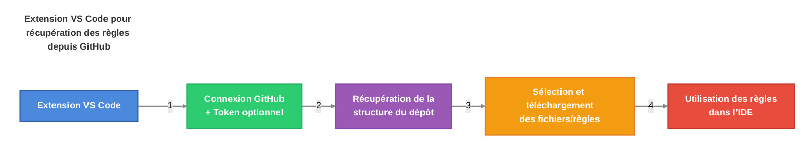

# AI-Driven Dev Rules


[](https://discord.gg/invite/ai-driven-dev)

Partagez vos règles IA personnalisées avec la communauté.

## Table des matières

- [Table des matières](#table-des-matières)
- [🧠 Avantages](#-avantages)
  - [Des règles optimisées en 3 minutes](#des-règles-optimisées-en-3-minutes)
- [👨‍💻 Comment installer les règles AIDD ?](#-comment-installer-les-règles-aidd-)
  - [Télécharger l'extension "AI-Driven Dev Rules"](#télécharger-lextension-ai-driven-dev-rules)
  - [Utiliser l'extension](#utiliser-lextension)
- [🚀 Bien démarrer](#-bien-démarrer)
  - [Comment coder avec des règles ?](#comment-coder-avec-des-règles-)
  - [Démo Vidéo](#démo-vidéo)
- [✅ Ajouter vos règles](#-ajouter-vos-règles)
  - [1. Structure de nommage (à plat)](#1-structure-de-nommage-à-plat)
  - [2. Organisation des dossiers](#2-organisation-des-dossiers)
  - [3. Générations et Mises à jour](#3-générations-et-mises-à-jour)
  - [Bonus : Démo](#bonus--démo)
- [🇫🇷 Contributions disponibles](#-contributions-disponibles)

## 🧠 Avantages

- 🎯 Créer des règles optimisées pour Cursor
- 🤝 Partagées et validées par la communauté
- 📋 Structure uniforme pour tous les contributeurs
- 🚀 Simple et rapide pour contribuer

### Des règles optimisées en 3 minutes

L'essence est très simple.



## 👨‍💻 Comment installer les règles AIDD ?

### Télécharger l'extension "AI-Driven Dev Rules"

- Téléchargez la dernière version de l’extension depuis [ai-driven-dev-rules-0.0.1.vsix]("./vscode/ai-driven-dev-rules/ai-driven-dev-rules-0.0.1.vsix")
- Ouvrez Cursor
- Ouvrez la palette de commandes (Ctrl + Shift + P)
- Tapez `Extension: Install from VSIX`

### Utiliser l'extension

Demain...Vendredi 18 avril 2025.

## 🚀 Bien démarrer

### Comment coder avec des règles ?

1. Ouvrir le mode Agent de votre IDE (comme Cursor).
2. Donner du contexte avec votre prompt: `use real users in @admin.tsx from @users.controller.ts`
3. Le chat devrait charger les règles correspondantes.

Bonus:

> Demander à l'agent s'il a bien respecté les règles.

```markdown
Vérifie l'application des règles.
```

### Démo Vidéo

Demain...Vendredi 18 avril 2025.

## ✅ Ajouter vos règles

Contribuer aux règles AI-Driven Dev est TRÈS simple et direct.

### 1. Structure de nommage (à plat)

Toutes les règles sont stockées dans un dossier dédié appelé `.cursor/rules`.

La structure suivante est utilisée, selon le format :

```text
#-rule-name[@version][-specificity].mdc
```

Exemples:

```text
3-react.mdc
3-react@18.mdc
3-react@19.mdc
3-react@19-hook.mdc
3-react@19.1-hook.mdc
```

Tableau de correspondance:

| Partie | Description | Obligatoire |
| ------ | ----------- | ----------- |
| `3` | Numéro catégorie | ✅ |
| `react` | Nom | ✅ |
| `@19.1` | Version | Optionnel |
| `-hooks` | Sous-partie spécifique | Optionnel |
| `.mdc` | Extension pour Cursor | ✅ |

### 2. Organisation des dossiers

Les règles sont organisées par dossiers, chaque dossier représentant une catégorie.

| Numéro | Catégorie | Exemples |
| ------ | --------- | -------- |
| `00` | 🏛️ `architecture` | Clean, Onion, 3-tiers... |
| `01` | 📏 `standards` | Coding, Naming, formatting, structure |
| `02` | 💻 `programming-languages` | JavaScript, TypeScript, Python |
| `03` | 🛠️ `frameworks-and-libraries` | React, Vue, Angular, Next.js |
| `04` | ⚙️ `tools-and-configurations` | Git, ESLint, Webpack, Docker |
| `05` | 🔄 `workflows-and-processes` | PR reviews, deployment, CI/CD |
| `06` | 📋 `templates-and-models` | Project templates, PRDs, READMEs |
| `07` | ✅ `quality-assurance` | Testing, security, performance |
| `08` | 🎯 `domain-specific-rules` | À partager avec votre équipe |
| `09` | 🔍 `other` | Ne rentre dans aucune autre catégorie |

### 3. Générations et Mises à jour

1. Ouvrir un nouveau Terminal de chat.
2. Pointer vers `@rules/generator.md`.
3. Demander à l'IA.

**Créer une nouvelle règle :**

```markdown
@rules/generator.md

Generate a new rule for:
```

**Mettre à jour une règle existante :**

```markdown
@rules/generator.md

Update rule: @rules/my-rule.md

With new specs:
- 
```

### Bonus : Démo

Demain...Vendredi 18 avril 2025.

## 🇫🇷 Contributions disponibles

Vous pouvez contribuer à ce projet en :

- Partager ses règles
- Améliorer les règles existantes
- Maintenir l'extension VSCode

[](https://discord.gg/invite/ai-driven-dev)

[>>> Voir plus <<<](./CONTRIBUTING.md)
