# 📐 AI-Driven Dev {Rules}


[](https://discord.gg/invite/ai-driven-dev)

Share your Custom AI Rules with the community.

## Table of Contents

- [Table of Contents](#table-of-contents)
- [Benefits](#benefits)
- [Core features](#core-features)
- [How-to install Rules](#how-to-install-rules)
  - [Download the AI-Driven Dev Rules extension](#download-the-ai-driven-dev-rules-extension)
  - [Use the extension](#use-the-extension)
- [Getting Started](#getting-started)
  - [Flat Structure](#flat-structure)
  - [Base template](#base-template)
  - [Generate or Update a rule](#generate-or-update-a-rule)
- [Contribution](#contribution)

## Benefits

- Shared and validated rules
- Same structure for everyone
- Easy to contribute
- Easy to use and integrate with existing workflows
- Easy to update and maintain (coming soon)

## Core features

The essence is quite simple.

```mermaid
flowchart LR
    %% Title of the diagram
    classDef titleClass fill:none,stroke:none,color:#333333,font-size:16px,font-weight:bold
    title[VS Code Extension for GitHub Rules Retrieval]
    class title titleClass
    
    A[VS Code Extension] -->|1| B[GitHub Connection\n+ Optional Token]
    B -->|2| C[Retrieve Repository\nStructure]
    C -->|3| D[Select and Download\nFiles/Rules]
    D -->|4| E[Use Rules\nin IDE]
    
    %% Styles améliorés avec dégradés et arrondis
    style A fill:#4b89dc,stroke:#2e5daa,color:white,stroke-width:2px,border-radius:10px,font-weight:bold
    style B fill:#2ecc71,stroke:#27ae60,color:white,stroke-width:2px,border-radius:10px,font-weight:bold
    style C fill:#9b59b6,stroke:#8e44ad,color:white,stroke-width:2px,border-radius:10px,font-weight:bold
    style D fill:#f39c12,stroke:#e67e22,color:white,stroke-width:2px,border-radius:10px,font-weight:bold
    style E fill:#e74c3c,stroke:#c0392b,color:white,stroke-width:2px,border-radius:10px,font-weight:bold
    
    %% Style des liens
    linkStyle 0,1,2,3 stroke-width:2px,stroke:#888888,color:black
```



## How-to install Rules

### Download the AI-Driven Dev Rules extension

- Download the latest version of the extension from [ai-driven-dev-rules-0.0.1.vsix]("./vscode/ai-driven-dev-rules/ai-driven-dev-rules-0.0.1.vsix")
- Open Cursor
- Open the Command Palette (Ctrl + Shift + P)
- Type `Extension: Install from VSIX`

### Use the extension

YouTube Video incoming...

## Getting Started

Contributing to the AI-Driven Dev Rules is VERY easy and straightforward.

### Flat Structure

Every rules are stored in a dedicated folder called `.cursor/rules`.

The following folder structure is used, in compliance with

```text
3-react-router.server-data-loading@7.5.mdc

^       ^          ^                ^   ^  
|       |          |                |   | 

#-xxxxxxxxxxxx.yyyyyyyyyyyyyyyyyyy@yyy.mdc
```

Rules are organized in folders, each folder representing a category.

| Number     | Category                 | Examples                         |
| --------- | ------------------------ | -------------------------------- |
| `00` | architecture | Clean, Onion, 3-tiers... |
| `01` | standards | Coding, Naming, formatting, structure    |
| `02` | programming-languages | JavaScript, TypeScript, Python   |
| `03` | frameworks-and-libraries | React, Vue, Angular, Next.js     |
| `04` | tools-and-configurations | Git, ESLint, Webpack, Docker     |
| `05` | workflows-and-processes | PR reviews, deployment, CI/CD    |
| `06` | templates-and-models | Project templates, PRDs, READMEs |
| `07` | quality-assurance | Testing, security, performance   |
| `08` | domain-specific-rules | To share with your team  |
| `09` | other | Cannot fit in other categories                |

### Base template

Rules are compatible with:

- Cursor

Coming Soon:

- Cline
- GitHub Copilot
- Windsurf

> Want more covered? Join our French Discord.

### Generate or Update a rule

1. Open a new chat Terminal.
2. Point to `@rules/generator.md`.
3. Ask AI.

**Create a new rule:**

```text
Help me generate a new rule for: ...

Following this: @rules/generator.md
```

**Update an existing rule:**

```text
Update the rule @rules/my-rule.md for: ...

Following this: @rules/generator.md
```

And... voilà 🇫🇷

## Contribution

You can contribute:

- By adding new rules
- By improving existing rules
- Becoming a core maintainer
- Code the AI-Driven Dev Rule VSCode's extension

[>>> See more <<<](./CONTRIBUTING.md)

En cours de rédaction...
