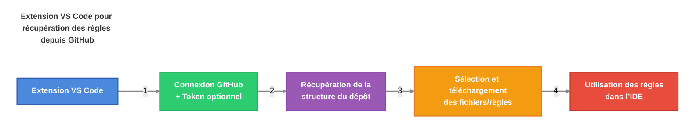

# AI-Driven Dev Rules


[](https://discord.gg/invite/ai-driven-dev)

Partagez vos règles IA personnalisées avec la communauté.

>
> Pour celles et ceux qui recherchent le système de KB de Christophe, un dépôt est en cours de création !
>

Envie de faire avec nous ?
[>>> 🔥 REJOINDRE LA CORE TEAM <<<](./CONTRIBUTING.md)

## Table des matières

- [Table des matières](#table-des-matières)
- [🧠 4 minutes pour commencer](#-4-minutes-pour-commencer)
- [👨‍💻 Comment installer les règles AIDD ?](#-comment-installer-les-règles-aidd-)
  - [Télécharger l'extension "AI-Driven Dev Rules"](#télécharger-lextension-ai-driven-dev-rules)
  - [Utiliser l'extension](#utiliser-lextension)
- [🚀 Bien démarrer](#-bien-démarrer)
  - [Comment coder avec des règles ?](#comment-coder-avec-des-règles-)
- [✅ Ajouter vos règles](#-ajouter-vos-règles)
  - [1. Structure de nommage (à plat)](#1-structure-de-nommage-à-plat)
  - [2. Organisation des dossiers](#2-organisation-des-dossiers)
  - [3. Générations et Mises à jour](#3-générations-et-mises-à-jour)
  - [4. Exemple d'une bonne règle](#4-exemple-dune-bonne-règle)
  - [Bonus : Démo](#bonus--démo)
- [🇫🇷 Contributions disponibles](#-contributions-disponibles)

## 🧠 4 minutes pour commencer

Avantages :

- **Apprendre à générer** des règles IA
- **Créer des règles optimisées** pour Cursor (partagées et validées par la communauté)
- **Standard de contribution** pour tous les contributeurs
- **Ultra simple** et rapide à setup

Flow :



## 👨‍💻 Comment installer les règles AIDD ?

### Télécharger l'extension "AI-Driven Dev Rules"

1. Télécharger la dernière version [ai-driven-dev-rules-0.0.2.vsix](https://github.com/ai-driven-dev/rules/blob/main/vscode/ai-driven-dev-rules/ai-driven-dev-rules-0.0.2.vsix)
2. Ouvrir Cursor
3. Dans la palette de commandes (`Ctrl + Shift + P`)
4. Taper `Extension: Install from VSIX`
5. Installer l'extension et cliquer sur le nouvelle icône GitHub !

Problèmes connus :

> L'API de GitHub est open mais vous pouvez vous faire Rate Limit.

1. Récupérer un Token sur GitHub [https://github.com/settings/tokens](https://github.com/settings/tokens).
2. AUCUN ROLE NÉCESSAIRE.
3. Dans VSCode, ouvrir les Réglages.
4. Rechercher: `Aidd: GitHub Token`.
5. **Rajouter votre Token pour éviter une réponse HTTP 429**

### Utiliser l'extension

> Vidéo prévue ce vendredi 18 avril 2025

1. Ouvrir l'extension "AI-Driven Dev Rules" via l'icône GitHub
2. Cliquer sur le bouton `Add Repository` (ou utilisez directement notre dépôt ⭐ Featured)
3. Télécharger le dossier `.cursor/rules`.

## 🚀 Bien démarrer

### Comment coder avec des règles ?

> Vidéo prévue ce vendredi 18 avril 2025

1. Ouvrir le mode Agent de votre IDE (comme Cursor).
2. Donner du contexte avec votre prompt: `use real users in @admin.tsx from @users.controller.ts`.
3. L'agent crée les règles correspondantes AVEC VOUS.

Bonus:

> Demander à l'agent s'il a bien respecté les règles.

```markdown
Vérifie l'application des règles.
```

## ✅ Ajouter vos règles

Contribuer aux règles AI-Driven Dev est TRÈS simple et direct.

### 1. Structure de nommage (à plat)

Stockage flat dans `.cursor/rules`.

Nom des règles :

```text
#-rule-name[@version][-specificity].mdc
```

- `#` : Numéro de la catégorie (voir ci-dessous)
- `-rule-name` : Nom de la règle
- `@version` : Version de la règle (*optionnel*)
- `-specificity` : Sous-partie spécifique (*optionnel*)
- `.mdc` : Extension pour Cursor

### 2. Organisation des dossiers

Les règles sont organisées par dossiers, chaque dossier représentant une catégorie.

| Numéro | Catégorie | Exemples |
| ------ | --------- | -------- |
| `00` | 🏛️ `architecture` | Clean, Onion, 3-tiers... |
| `01` | 📏 `standards` | Coding, Naming, formatting, structure |
| `02` | 💻 `programming-languages` | JavaScript, TypeScript, Python |
| `03` | 🛠️ `frameworks-and-libraries` | React, Vue, Angular, Next.js |
| `04` | ⚙️ `tools-and-configurations` | Git, ESLint, Webpack, Docker |
| `05` | 🔄 `workflows-and-processes` | PR reviews, deployment, CI/CD |
| `06` | 📋 `templates-and-models` | Project templates, PRDs, READMEs |
| `07` | ✅ `quality-assurance` | Testing, security, performance |
| `08` | 🎯 `domain-specific-rules` | À partager avec votre équipe |
| `09` | 🔍 `other` | Ne rentre dans aucune autre catégorie |

Exemples :

```text
./.cursor/rules/03-frameworks-and-libraries/
├── 3-react.mdc
├── 3-react@18.mdc
├── 3-react@19.mdc
├── 3-react@19-hook.mdc
└── 3-react@19.1-hook.mdc
```

### 3. Générations et Mises à jour

> Vidéo prévue ce vendredi 18 avril 2025

1. Ouvrir un chat **en mode Agent**.
2. Choisir le modèle `GPT 4.1`.
3. Ajouter la Cursor Rules `meta-generator.mdc`.
4. Promptez !

**Créer une nouvelle règle :**

```markdown
Generate cursor rules for: ...
```

**Créer une nouvelle règle (depuis un example) :**

```markdown
Based on example, generate cursor rules for: ...

<example>
...
</example>
```

**Mettre à jour une règle existante :**

```markdown
Update cursor rules with: ...

@3-react@18.mdc
```

### 4. Exemple d'une bonne règle

Les règles générées doivent être le plus court possible.

Exemple : [./.cursor/rules/01-standards/1-clean-code.mdc](./.cursor/rules/01-standards/1-clean-code.mdc)

### Bonus : Démo

Demain...Vendredi 18 avril 2025.

## 🇫🇷 Contributions disponibles

Vous pouvez contribuer à ce projet en :

- Partager ses règles
- Améliorer les règles existantes
- Maintenir l'extension VSCode

[>>> 🔥 REJOINDRE LA CORE TEAM <<<](./CONTRIBUTING.md)
