# AI-Driven Dev Rules 🥖


[](https://discord.gg/invite/ai-driven-dev)

Partagez vos règles IA personnalisées avec la communauté.

## Table des matières

- [Table des matières](#table-des-matières)
- [Avantages](#avantages)
- [Fonctionnalités principales](#fonctionnalités-principales)
- [Comment installer les règles AIDD ?](#comment-installer-les-règles-aidd-)
  - [Télécharger l'extension "AI-Driven Dev Rules"](#télécharger-lextension-ai-driven-dev-rules)
  - [Utiliser l'extension](#utiliser-lextension)
- [Bien démarrer](#bien-démarrer)
- [Comment coder avec des règles ?](#comment-coder-avec-des-règles-)
- [Ajouter vos règles](#ajouter-vos-règles)
  - [Structure de nommage (à plat)](#structure-de-nommage-à-plat)
  - [Générations et Mises à jour](#générations-et-mises-à-jour)
- [Contributions disponibles](#contributions-disponibles)

## Avantages

- 🎯 Créer des règles optimisées pour Cursor
- 🤝 Partagées et validées par la communauté
- 📋 Structure uniforme pour tous les contributeurs
- 🚀 Simple et rapide pour contribuer

## Fonctionnalités principales

L'essence est très simple.

```mermaid
flowchart LR
    classDef titleClass fill:none,stroke:none,color:#333333,font-size:16px,font-weight:bold
    title[Extension VS Code pour récupération des règles depuis GitHub]
    class title titleClass
    
    A[Extension VS Code] -->|1| B[Connexion GitHub\n+ Token optionnel]
    B -->|2| C[Récupération de la\nstructure du dépôt]
    C -->|3| D[Sélection et téléchargement\ndes fichiers/règles]
    D -->|4| E[Utilisation des règles\ndans l’IDE]
    
    style A fill:#4b89dc,stroke:#2e5daa,color:white,stroke-width:2px,border-radius:10px,font-weight:bold
    style B fill:#2ecc71,stroke:#27ae60,color:white,stroke-width:2px,border-radius:10px,font-weight:bold
    style C fill:#9b59b6,stroke:#8e44ad,color:white,stroke-width:2px,border-radius:10px,font-weight:bold
    style D fill:#f39c12,stroke:#e67e22,color:white,stroke-width:2px,border-radius:10px,font-weight:bold
    style E fill:#e74c3c,stroke:#c0392b,color:white,stroke-width:2px,border-radius:10px,font-weight:bold
    
    linkStyle 0,1,2,3 stroke-width:2px,stroke:#888888,color:black
```



## Comment installer les règles AIDD ?

### Télécharger l'extension "AI-Driven Dev Rules"

- Téléchargez la dernière version de l’extension depuis [ai-driven-dev-rules-0.0.1.vsix]("./vscode/ai-driven-dev-rules/ai-driven-dev-rules-0.0.1.vsix")
- Ouvrez Cursor
- Ouvrez la palette de commandes (Ctrl + Shift + P)
- Tapez `Extension: Install from VSIX`

### Utiliser l'extension

Vidéo YouTube en préparation...

## Bien démarrer

Contribuer aux règles AI-Driven Dev est TRÈS simple et direct.

## Comment coder avec des règles ?

1. Ouvrir le mode Agent de votre IDE (comme Cursor).
2. Donner du contexte avec votre prompt: `use real users in @admin.tsx from @users.controller.ts`
3. Le chat devrait charger les règles correspondantes.

Bonus:

> Demander à l'agent s'il a bien respecté les règles.

```markdown
Vérifie l'application des règles.
```

## Ajouter vos règles

### Structure de nommage (à plat)

Toutes les règles sont stockées dans un dossier dédié appelé `.cursor/rules`.

La structure suivante est utilisée, selon le format :

| Partie | Description | Obligatoire |
| ------ | ----------- | ----------- |
| `3` | Numéro catégorie | ✅ |
| `react` | Nom | ✅ |
| `@19.1` | Version | Optionnel |
| `-hooks` | Sous-partie spécifique | Optionnel |
| `.mdc` | Extension pour Cursor | ✅ |

Pattern:

```text
#-rule-name[@version][-specificity].mdc
```

Exemples:

```text
3-react.mdc
3-react@18.mdc
3-react@19.mdc
3-react@19-hook.mdc
3-react@19.1-hook.mdc
```

Les règles sont organisées par dossiers, chaque dossier représentant une catégorie.

| Numéro | Catégorie | Exemples |
| ------ | --------- | -------- |
| `00` | 🏛️ `architecture` | Clean, Onion, 3-tiers... |
| `01` | 📏 `standards` | Coding, Naming, formatting, structure |
| `02` | 💻 `programming-languages` | JavaScript, TypeScript, Python |
| `03` | 🛠️ `frameworks-and-libraries` | React, Vue, Angular, Next.js |
| `04` | ⚙️ `tools-and-configurations` | Git, ESLint, Webpack, Docker |
| `05` | 🔄 `workflows-and-processes` | PR reviews, deployment, CI/CD |
| `06` | 📋 `templates-and-models` | Project templates, PRDs, READMEs |
| `07` | ✅ `quality-assurance` | Testing, security, performance |
| `08` | 🎯 `domain-specific-rules` | À partager avec votre équipe |
| `09` | 🔍 `other` | Ne rentre dans aucune autre catégorie |

### Générations et Mises à jour

1. Ouvrir un nouveau Terminal de chat.
2. Pointer vers `@rules/generator.md`.
3. Demander à l'IA.

**Créer une nouvelle règle :**

```markdown
@rules/generator.md

Generate a new rule for:
```

**Mettre à jour une règle existante :**

```markdown
@rules/generator.md

Update rule: @rules/my-rule.md

With new specs:
- 
```

Et... voilà 🇫🇷

## Contributions disponibles

- Partager ses règles
- Améliorer les règles existantes
- Maintenir l'extension VSCode

[>>> Voir plus <<<](./CONTRIBUTING.md)
