# AI-Driven Dev Rules


[](https://discord.gg/invite/ai-driven-dev)

Partagez vos règles IA personnalisées avec la communauté.

>
> Pour celles et ceux qui recherchent le système de KB de Christophe, un dépôt est en cours de création !
>

## Table des matières

- [Table des matières](#table-des-matières)
- [🧠 Avantages](#-avantages)
  - [Des règles optimisées en 3 minutes](#des-règles-optimisées-en-3-minutes)
- [👨‍💻 Comment installer les règles AIDD ?](#-comment-installer-les-règles-aidd-)
  - [Télécharger l'extension "AI-Driven Dev Rules"](#télécharger-lextension-ai-driven-dev-rules)
  - [Utiliser l'extension](#utiliser-lextension)
- [🚀 Bien démarrer](#-bien-démarrer)
  - [Comment coder avec des règles ?](#comment-coder-avec-des-règles-)
  - [Démo Vidéo](#démo-vidéo)
- [✅ Ajouter vos règles](#-ajouter-vos-règles)
  - [1. Structure de nommage (à plat)](#1-structure-de-nommage-à-plat)
  - [2. Organisation des dossiers](#2-organisation-des-dossiers)
  - [3. Générations et Mises à jour](#3-générations-et-mises-à-jour)
  - [Bonus : Démo](#bonus--démo)
- [🇫🇷 Contributions disponibles](#-contributions-disponibles)

## 🧠 Avantages

- 🎯 Créer des règles optimisées pour Cursor
- 🤝 Partagées et validées par la communauté
- 📋 Structure uniforme pour tous les contributeurs
- 🚀 Simple et rapide pour contribuer

### Des règles optimisées en 3 minutes

L'essence est très simple.

```mermaid
flowchart LR
    classDef titleClass fill:none,stroke:none,color:#333333,font-size:16px,font-weight:bold
    title[Extension VS Code pour récupération des règles depuis GitHub]
    class title titleClass
    
    A[Extension VS Code] -->|1| B[Connexion GitHub\n+ Token optionnel]
    B -->|2| C[Récupération de la\nstructure du dépôt]
    C -->|3| D[Sélection et téléchargement\ndes fichiers/règles]
    D -->|4| E[Utilisation des règles\ndans l’IDE]
    
    style A fill:#4b89dc,stroke:#2e5daa,color:white,stroke-width:2px,border-radius:10px,font-weight:bold
    style B fill:#2ecc71,stroke:#27ae60,color:white,stroke-width:2px,border-radius:10px,font-weight:bold
    style C fill:#9b59b6,stroke:#8e44ad,color:white,stroke-width:2px,border-radius:10px,font-weight:bold
    style D fill:#f39c12,stroke:#e67e22,color:white,stroke-width:2px,border-radius:10px,font-weight:bold
    style E fill:#e74c3c,stroke:#c0392b,color:white,stroke-width:2px,border-radius:10px,font-weight:bold
    
    linkStyle 0,1,2,3 stroke-width:2px,stroke:#888888,color:black
```



## 👨‍💻 Comment installer les règles AIDD ?

### Télécharger l'extension "AI-Driven Dev Rules"

- Téléchargez la dernière version de l’extension depuis [ai-driven-dev-rules-0.0.1.vsix]("./vscode/ai-driven-dev-rules/ai-driven-dev-rules-0.0.1.vsix")
- Ouvrez Cursor
- Ouvrez la palette de commandes (Ctrl + Shift + P)
- Tapez `Extension: Install from VSIX`

### Utiliser l'extension

Demain...Vendredi 18 avril 2025.

## 🚀 Bien démarrer

### Comment coder avec des règles ?

1. Ouvrir le mode Agent de votre IDE (comme Cursor).
2. Donner du contexte avec votre prompt: `use real users in @admin.tsx from @users.controller.ts`
3. Le chat devrait charger les règles correspondantes.

Bonus:

> Demander à l'agent s'il a bien respecté les règles.

```markdown
Vérifie l'application des règles.
```

### Démo Vidéo

Demain...Vendredi 18 avril 2025.

## ✅ Ajouter vos règles

Contribuer aux règles AI-Driven Dev est TRÈS simple et direct.

### 1. Structure de nommage (à plat)

Toutes les règles sont stockées dans un dossier dédié appelé `.cursor/rules`.

La structure suivante est utilisée, selon le format :

```text
#-rule-name[@version][-specificity].mdc
```

- `#` : Numéro de la catégorie (voir ci-dessous)
- `-rule-name` : Nom de la règle
- `@version` : Version de la règle (*optionnel*)
- `-specificity` : Sous-partie spécifique (*optionnel*)
- `.mdc` : Extension pour Cursor

Exemples:

```text
./.cursor/rules/03-frameworks-and-libraries/
├── 3-react.mdc
├── 3-react@18.mdc
├── 3-react@19.mdc
├── 3-react@19-hook.mdc
└── 3-react@19.1-hook.mdc
```

### 2. Organisation des dossiers

Les règles sont organisées par dossiers, chaque dossier représentant une catégorie.

| Numéro | Catégorie | Exemples |
| ------ | --------- | -------- |
| `00` | 🏛️ `architecture` | Clean, Onion, 3-tiers... |
| `01` | 📏 `standards` | Coding, Naming, formatting, structure |
| `02` | 💻 `programming-languages` | JavaScript, TypeScript, Python |
| `03` | 🛠️ `frameworks-and-libraries` | React, Vue, Angular, Next.js |
| `04` | ⚙️ `tools-and-configurations` | Git, ESLint, Webpack, Docker |
| `05` | 🔄 `workflows-and-processes` | PR reviews, deployment, CI/CD |
| `06` | 📋 `templates-and-models` | Project templates, PRDs, READMEs |
| `07` | ✅ `quality-assurance` | Testing, security, performance |
| `08` | 🎯 `domain-specific-rules` | À partager avec votre équipe |
| `09` | 🔍 `other` | Ne rentre dans aucune autre catégorie |

### 3. Générations et Mises à jour

1. Ouvrir un nouveau Terminal de chat.
2. Pointer vers `@rules/generator.md`.
3. Demander à l'IA.

**Créer une nouvelle règle :**

```markdown
Generate cursor rules for: ...
```

**Créer une nouvelle règle (depuis un example) :**

```markdown
Based on example, generate cursor rules for: ...

<example>
...
</example>
```

**Mettre à jour une règle existante :**

```markdown
Update cursor rules with: ...

@3-react@18.mdc
```

### Bonus : Démo

Demain...Vendredi 18 avril 2025.

## 🇫🇷 Contributions disponibles

Vous pouvez contribuer à ce projet en :

- Partager ses règles
- Améliorer les règles existantes
- Maintenir l'extension VSCode

[](https://discord.gg/invite/ai-driven-dev)

[>>> Voir plus <<<](./CONTRIBUTING.md)
