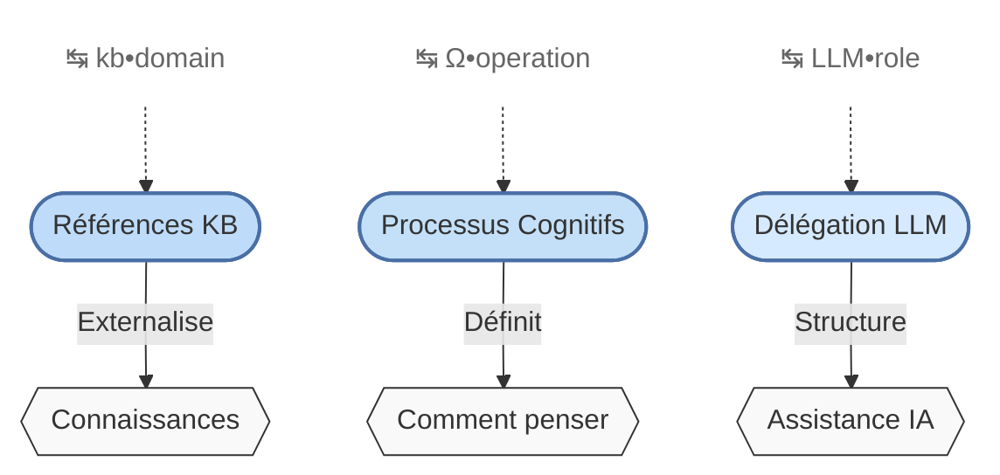
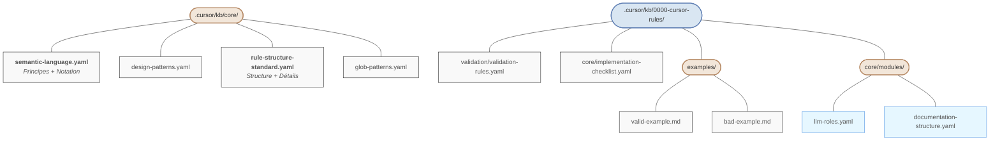
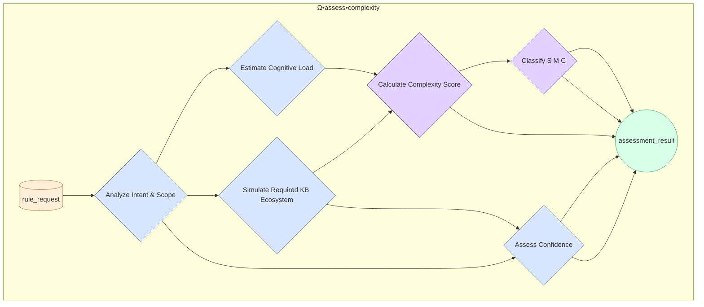
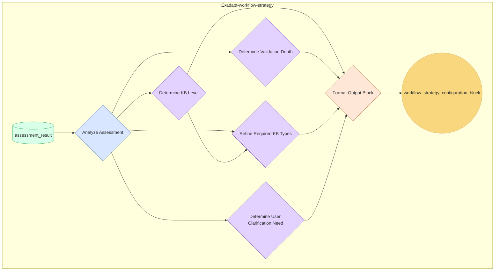
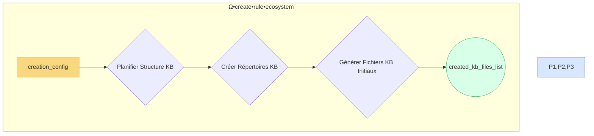
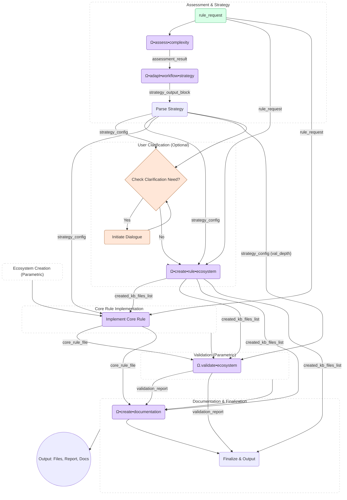
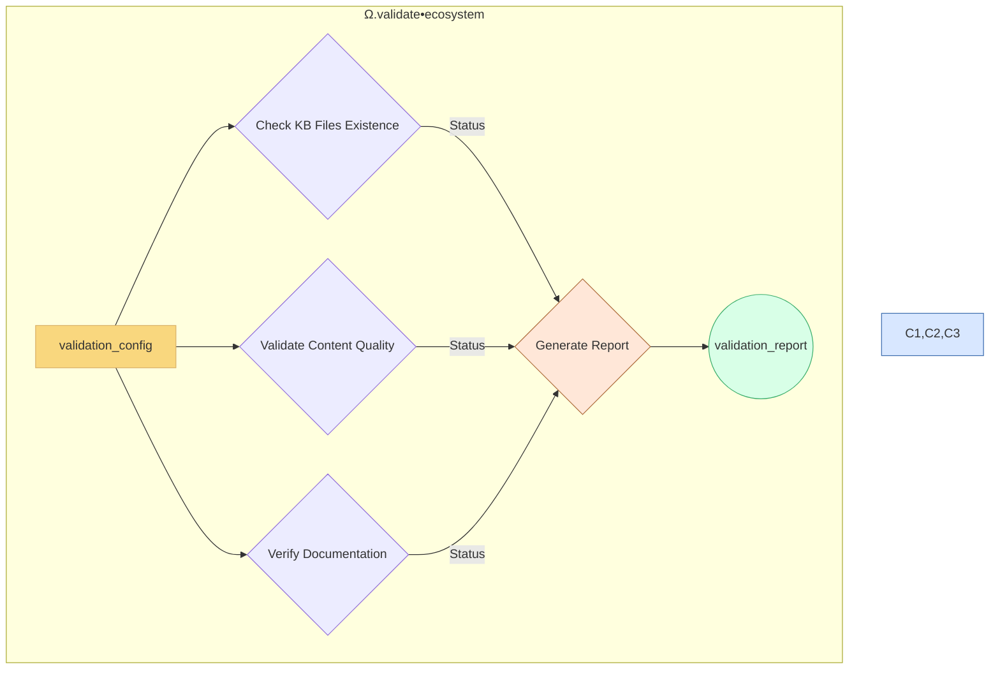
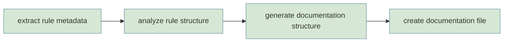
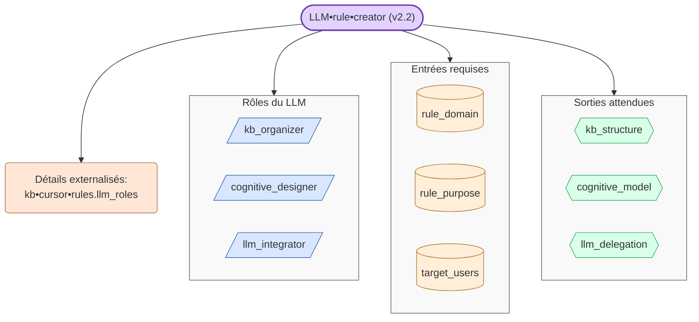
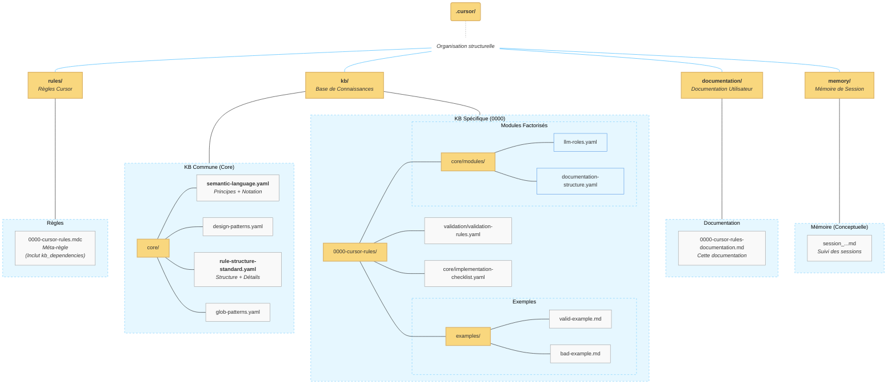

# Documentation de la Méta-Règle pour la Création de Règles Cursor

- [📋 Résumé](#-résumé)
- [🧠 Concepts Fondamentaux](#-concepts-fondamentaux)
  - [Principes de Compression Sémantique](#principes-de-compression-sémantique)
  - [Les Trois Piliers d'une Règle Cursor](#les-trois-piliers-dune-règle-cursor)
  - [Adaptation Basée sur la Complexité (Nouveauté v3.x)](#adaptation-basée-sur-la-complexité-nouveauté-v3x)
  - [Architecture de la Base de Connaissances (KB) - **Mise à jour**](#architecture-de-la-base-de-connaissances-kb---mise-à-jour)
- [⚙️ Nouveaux Modules Clés (v3.x)](#️-nouveaux-modules-clés-v3x)
  - [1. Module d'Évaluation de Complexité (`Ω•assess•complexity`)](#1-module-dévaluation-de-complexité-ωassesscomplexity)
  - [2. Module d'Adaptation de Stratégie (`Ω•adapt•workflow•strategy`)](#2-module-dadaptation-de-stratégie-ωadaptworkflowstrategy)
  - [3. Module de Création d'Écosystème (`Ω•create•rule•ecosystem`)](#3-module-de-création-décosystème-ωcreateruleecosystem)
- [🔄 Workflow de Création des Règles (Ω•create•rule) Refactorisé (v3.x)](#-workflow-de-création-des-règles-ωcreaterule-refactorisé-v3x)
- [🔍 Protocole de Validation de l'Écosystème (Ω.validate•ecosystem) Adapté (v3.x)](#-protocole-de-validation-de-lécosystème-ωvalidateecosystem-adapté-v3x)
- [🔄 Processus de Génération de Documentation (Ω•create•documentation)](#-processus-de-génération-de-documentation-ωcreatedocumentation)
  - [Étapes du processus de documentation](#étapes-du-processus-de-documentation)
- [🤖 Stratégie de Délégation au LLM (v2.2)](#-stratégie-de-délégation-au-llm-v22)
    - [LLM•kb•content•generator](#llmkbcontentgenerator)
    - [LLM•documentation•generator](#llmdocumentationgenerator)
- [🌲 Arborescence des Fichiers de la Méta-Règle - **Mise à jour**](#-arborescence-des-fichiers-de-la-méta-règle---mise-à-jour)
  - [Représentation Graphique](#représentation-graphique)
  - [Représentation Textuelle Détaillée - **Mise à jour**](#représentation-textuelle-détaillée---mise-à-jour)
  - [Relations entre les composants - **Mis à jour**](#relations-entre-les-composants---mis-à-jour)
- [🧩 Modules Factorisés - **Mis à jour**](#-modules-factorisés---mis-à-jour)
- [🍳 Cookbook / Scénarios Pratiques](#-cookbook--scénarios-pratiques)
  - [Scénario 1 : Création d'une Règle de Scaffolding Vue 3 (Complexité Moyenne)](#scénario-1--création-dune-règle-de-scaffolding-vue-3-complexité-moyenne)
  - [Scénario 2 : Création d'une Règle de Configuration d'Outil (Tailwind + Vite + SCSS)](#scénario-2--création-dune-règle-de-configuration-doutil-tailwind--vite--scss)
  - [Enseignements Clés des Scénarios](#enseignements-clés-des-scénarios)
- [✅ Liste de Vérification v3.x](#-liste-de-vérification-v3x)
- [📚 Ressources Additionnelles - **Mis à jour**](#-ressources-additionnelles---mis-à-jour)

## 📋 Résumé

La méta-règle `0000-cursor-rules.mdc` définit le standard et le processus de création des règles Cursor. Elle établit une méthodologie complète pour garantir des règles cohérentes, compréhensibles et efficaces à travers un système de compression sémantique, d'externalisation des connaissances et de processus cognitifs clairs. La version actuelle (3.1+) met l'accent sur la modularité, l'adaptation à la complexité, et la factorisation des connaissances tout en maintenant la séparation claire entre connaissances, processus cognitifs et rôles du LLM.

| Aspect               | Description                                                                             |
| -------------------- | --------------------------------------------------------------------------------------- |
| **Objectif**         | Standardiser la création et la modification des règles Cursor                           |
| **Applicabilité**    | S'applique à tous les fichiers `.cursor/rules/*.mdc`                                    |
| **Principe central** | Compression sémantique + référencement externe + workflow cognitif structuré            |
| **Format**           | Markdown avec compression sémantique                                                    |
| **Version actuelle** | 3.1 (organisation améliorée des fichiers et templates)                                  |
| **Prérequis**        | Comprendre les principes de compression sémantique et la structure des connaissances KB |

## 🧠 Concepts Fondamentaux

### Principes de Compression Sémantique

La compression sémantique est un système de notation qui permet de maximiser la densité d'information tout en maintenant la clarté et la précision. Elle utilise des symboles spécifiques pour représenter des concepts complexes de manière concise.

| Symbole | Signification             | Utilisation                                  |
| ------- | ------------------------- | -------------------------------------------- |
| `↹`     | Section/Catégorie         | Indique le début d'une section logique       |
| `⊕`     | Élément/Définition        | Définit un élément dans une section          |
| `→`     | Flux/Séquence             | Indique une étape séquentielle ou un flux    |
| `Σ`     | Résumé/Conclusion         | Résume ou conclut une section                |
| `⨁`     | Combinaison               | Indique la combinaison de plusieurs éléments |
| `⇌`     | Relation bidirectionnelle | Indique une relation dans les deux sens      |
| `•`     | Connecteur                | Relie des concepts ou termes associés        |
| `+`     | Addition                  | Indique l'ajout d'un concept ou propriété    |
| `[p=n]` | Niveau de priorité        | Indique l'importance (1=la plus élevée)      |

### Les Trois Piliers d'une Règle Cursor

La version 2.2 de la méta-règle maintient les trois piliers fondamentaux pour toute règle Cursor, mais avec une approche plus modulaire:



1. **Références KB** (`kb•domain`): Pointent vers des fichiers externes contenant les connaissances spécifiques au domaine, évitant la duplication d'information dans la règle elle-même.

2. **Processus Cognitifs** (`Ω•operation`): Définissent explicitement les processus de raisonnement, pas simplement ce qu'il faut savoir, mais comment réfléchir au problème.

3. **Délégation LLM** (`LLM•role`): Structure précisément comment le LLM doit contribuer, avec des entrées, sorties, contraintes et validations clairement définies.

### Adaptation Basée sur la Complexité (Nouveauté v3.x)

Pour pallier la rigidité potentielle d'un workflow unique, la version 3.x introduit une approche adaptative basée sur une évaluation préliminaire de la complexité de la règle à créer.

1. **Classification S/M/C :** Avant la création complète, la complexité de la demande de règle est évaluée et classifiée comme **Simple (S)**, **Moyenne (M)**, ou **Complexe (C)**.
2. **Modules Dédiés :** Deux nouveaux modules principaux gèrent ce processus :
    - `Ω•assess•complexity` : Évalue la demande.
    - `Ω•adapt•workflow•strategy` : Détermine la stratégie de création (niveau KB, profondeur de validation) en fonction de l'évaluation.
3. **Workflow Adapté :** Le workflow principal (`Ω•create•rule`) utilise la stratégie déterminée pour paramétrer les étapes de création de l'écosystème (`Ω•create•rule•ecosystem`) et de validation (`Ω.validate•ecosystem`).
4. **Externalisation Maintenue :** Le principe d'externalisation stricte des connaissances est conservé. Même une règle "Simple" requiert un écosystème KB externe minimal. La flexibilité réside dans la **quantité** et le **type** de fichiers KB exigés, ainsi que dans la **profondeur** de la validation.

Cette approche permet d'ajuster l'effort et la rigueur du processus à la nature de la règle, optimisant l'efficacité sans sacrifier la qualité pour les règles complexes.

### Architecture de la Base de Connaissances (KB) - **Mise à jour**

La structure KB a été rationalisée :



## ⚙️ Nouveaux Modules Clés (v3.x)

La version 3.x introduit deux modules essentiels pour l'approche adaptative.

### 1. Module d'Évaluation de Complexité (`Ω•assess•complexity`)

**Objectif :** Évaluer de manière structurée la complexité intrinsèque d'une demande de création de règle.

**Processus Interne :**



**Annotations pour le diagramme `Ω•assess•complexity` :**

- **P3 (Simulate Required KB Ecosystem) :** Estimation des types KB (guideline, example, template...), Suggestion KB minimal, Feedback interne.
- **P4 (Calculate Complexity Score) :** Combine Charge Cognitive et Estimation KB (poids initiaux).
- **P5 (Classify S M C) :** Application des seuils (<0.3, 0.3-0.7, >=0.7).
- **P6 (Assess Confidence) :** Évaluation clarté requête et fiabilité simulation.
- **P7 (assessment_result) :** Objet contenant score, classification, estimations, confiance, justification...

**Sortie Clé :** `assessment_result` (objet structuré) contenant le score, la classification S/M/C, l'estimation de l'empreinte KB, une suggestion de KB minimal (pour S), le score de confiance, et la justification.

### 2. Module d'Adaptation de Stratégie (`Ω•adapt•workflow•strategy`)

**Objectif :** Traduire l'évaluation de complexité en une configuration de stratégie concrète pour la suite du workflow.

**Processus Interne :**



**Annotations pour le diagramme `Ω•adapt•workflow•strategy` :**

- **D1 (Determine KB Level) :** Classification Mappée : S => Minimal, M => Standard, C => Comprehensive.
- **D2 (Determine Validation Depth) :** Basé sur Classification & Confiance (Ex: Simple/High => Basic, Low Conf => Standard...).
- **D3 (Refine Required KB Types) :** Filtre les types KB estimés selon le niveau KB (Minimal garde 1-2).
- **D4 (Determine User Clarification Need) :** Basé sur seuil de confiance (<0.7).
- **F1 (Format Output Block) :** Crée un bloc texte structuré clé-valeur standardisé.

**Sortie Clé :** `workflow_strategy_configuration_block` (bloc texte structuré) contenant `kb_creation_level`, `required_kb_types`, `validation_depth`, `trigger_user_clarification`, et `additional_guidance`. Ce bloc est ensuite parsé par le workflow principal.

### 3. Module de Création d'Écosystème (`Ω•create•rule•ecosystem`)

**Objectif :** Créer la structure de répertoires et les fichiers initiaux de la Base de Connaissances (KB) associés à une nouvelle règle, en respectant la stratégie de complexité (`kb_creation_level`, `required_kb_types`) déterminée précédemment.

**Inputs :** Objet `creation_config` contenant la requête initiale (`rule_request`) et les paramètres de stratégie (`kb_creation_level`, `required_kb_types`, `additional_guidance`).

**Processus Interne Simplifié :**



- **Planification :** Identifie les répertoires nécessaires (ex: `.cursor/kb/<rule_id>/`, `.cursor/kb/<rule_id>/examples/`, etc.) en fonction du `kb_creation_level` (Minimal, Standard, Comprehensive).
- **Création des Répertoires :** Génère la structure de dossiers planifiée.
- **Génération des Fichiers :** Crée les fichiers KB initiaux (vides ou basés sur des templates) correspondant aux `required_kb_types` (ex: `guideline.md`, `valid-example.md`, etc.), en utilisant `additional_guidance` si fournie. Garantit la création des fichiers minimaux même pour le niveau 'Minimal'.

**Sortie Clé :** `created_kb_files_list` (Liste des chemins des fichiers KB créés).

## 🔄 Workflow de Création des Règles (Ω•create•rule) Refactorisé (v3.x)

Le frontmatter YAML de la règle `.mdc` contient les métadonnées essentielles, y compris la nouvelle section `kb_dependencies` qui liste les fichiers KB externes requis pour la validation et la compréhension humaine.



**Étapes Clés du Workflow Refactorisé :**

1. **Évaluation & Stratégie :** Appel séquentiel de `Ω•assess•complexity` et `Ω•adapt•workflow•strategy`. Le bloc de configuration est parsé.
2. **Clarification Utilisateur (Optionnelle) :** Si le score de confiance est bas, un dialogue est initié pour confirmer/ajuster la stratégie.
3. **Création de l'Écosystème :** Appel de `Ω•create•rule•ecosystem` avec les paramètres `kb_creation_level`, `required_kb_types`, et `additional_guidance` issus de la stratégie.
4. **Implémentation de la Règle Cœur :** Génération du fichier `.mdc` principal. Le `kb_creation_level` peut influencer légèrement le détail de la règle elle-même.
5. **Validation :** Appel de `Ω.validate•ecosystem` avec les fichiers créés et le paramètre `validation_depth` issu de la stratégie.
6. **Documentation & Finalisation :** Génération de la documentation (`Ω•create•documentation`) et finalisation.

Ce workflow modulaire permet une adaptation fine du processus tout en gardant une structure claire.

_Note : La règle `0000-cursor-rules.mdc` contient également une section `Ω.validate` plus simple, focalisée sur la vérification de la présence et de la conformité des trois piliers structurels fondamentaux (références KB, opérations cognitives, délégation LLM) au sein du fichier `.mdc` de la règle elle-même. Cette validation structurelle complète la validation plus large de l'écosystème gérée par `Ω.validate•ecosystem`._

## 🔍 Protocole de Validation de l'Écosystème (Ω.validate•ecosystem) Adapté (v3.x)

Le protocole de validation de l'écosystème est maintenant paramétré par la `validation_depth` déterminée lors de la phase de stratégie.

**Input :** `validation_config` (objet contenant `rule_files` et `validation_depth`).

**Processus Adapté :**



**Annotations pour le diagramme `Ω.validate•ecosystem` :**

- **C1 (Check KB Files Existence) :** La rigueur dépend de `validation_depth` (Basic, Standard, Deep).
- **C2 (Validate Content Quality) :** La qualité minimale dépend de `validation_depth`.
- **C3 (Verify Documentation) :** Les vérifications dépendent de `validation_depth`.
- **C4 (Generate Report) :** Le standard de certification dépend de `validation_depth`.

Cela garantit que les règles simples ne sont pas soumises à une validation excessivement lourde, tandis que les règles complexes bénéficient d'un examen approfondi.

## 🔄 Processus de Génération de Documentation (Ω•create•documentation)

La version 2.2 introduit un processus formalisé pour la génération automatique de documentation:



### Étapes du processus de documentation

1. **extract•rule•metadata**: Extraire les métadonnées de la règle source
2. **analyze•rule•structure**: Analyser les sections de la règle et identifier les concepts clés
3. **generate•documentation•structure**: Générer la structure de documentation basée sur un template
4. **create•documentation•file**: Créer le fichier de documentation dans l'emplacement approprié

Ce processus permet de maintenir une documentation cohérente et à jour avec la règle elle-même.

## 🤖 Stratégie de Délégation au LLM (v2.2)

La version 2.2 clarifie davantage les rôles du LLM en externalisant leurs détails dans des modules dédiés:



Cette structure avec référence externe garantit que:

- La règle principale reste concise et focalisée sur l'essentiel
- Les détails d'implémentation sont externalisés dans des modules spécialisés
- Les mises à jour de l'un n'affectent pas nécessairement l'autre

#### LLM•kb•content•generator

Ce rôle est responsable de la génération du contenu substantiel pour les fichiers de la Base de Connaissances (KB).

- **Rôles :**
  - `guideline_author`: Rédige des guides clairs et utiles.
  - `example_creator`: Développe des exemples (bons et mauvais) illustratifs.
  - `template_designer`: Conçoit des modèles réutilisables.
  - `reference_compiler`: Assemble des informations standardisées et faisant autorité.
- **Entrées Requises :** Spécifications de la règle, public cible, cas d'utilisation.
- **Sorties Attendues :** Fichiers KB peuplés (guides, exemples, templates, références).
- **Contraintes :** Contenu complet, pratique, et cohérent avec la règle.

#### LLM•documentation•generator

Ce rôle prend en charge la création de la documentation utilisateur pour la règle.

- **Rôles :**
  - `content_analyzer`: Extrait les concepts clés de la règle.
  - `structure_designer`: Crée une structure de documentation logique.
  - `diagram_creator`: Génère des diagrammes explicatifs.
  - `ecosystem_documenter`: Documente la structure KB associée.
- **Sorties Attendues :** Fichier de documentation complet, guide d'implémentation.

## 🌲 Arborescence des Fichiers de la Méta-Règle - **Mise à jour**

### Représentation Graphique



### Représentation Textuelle Détaillée - **Mise à jour**

L'organisation post-consolidation est la suivante :

```text
.cursor/
│
├── rules/
│   └── 0000-cursor-rules.mdc  # MÉTA-RÈGLE (inclut kb_dependencies)
│
├── kb/
│   │
│   ├── core/                  # KB COMMUNE
│   │   ├── semantic-language.yaml        # Fusion: Principes + Notation
│   │   ├── design-patterns.yaml
│   │   ├── rule-structure-standard.yaml  # Fusion: Structure + Détails
│   │   └── glob-patterns.yaml
│   │
│   └── 0000-cursor-rules/     # KB SPÉCIFIQUE À LA MÉTA-RÈGLE
│       │
│       ├── validation/validation-rules.yaml
│       ├── core/implementation-checklist.yaml
│       │
│       ├── examples/
│       │   ├── valid-example.md
│       │   └── bad-example.md
│       │
│       └── core/modules/        # MODULES FACTORISÉS
│           ├── llm-roles.yaml
│           └── documentation-structure.yaml
│           # (rule-structure-details.yaml fusionné)
│
├── documentation/
│   └── 0000-cursor-rules-documentation.md # Cette documentation
│
└── memory/
    └── session_...md          # Suivi conceptuel des sessions
```

### Relations entre les composants - **Mis à jour**

- **Règle principale** (`.mdc`) : Contient la logique, les workflows, et le **manifeste `kb_dependencies`**. Fait référence aux modules et KB consolidés.
- **Modules factorisés** : `llm-roles.yaml`, `documentation-structure.yaml` (dans `kb/0000-cursor-rules/core/modules/`).
- **Fichiers KB Core Consolidés** : `semantic-language.yaml`, `rule-structure-standard.yaml`.
- **Documentation** : Ce document, mis à jour pour refléter la structure actuelle.

## 🧩 Modules Factorisés - **Mis à jour**

_(Note : L'ancien module `rule-structure-details.yaml` a été fusionné dans `core/rule-structure-standard.yaml`)_

## 🍳 Cookbook / Scénarios Pratiques

Cette section présente deux scénarios complets d'utilisation de la méta-règle `0000` pour créer et utiliser des règles Cursor.

### Scénario 1 : Création d'une Règle de Scaffolding Vue 3 (Complexité Moyenne)

**Objectif :** Création et utilisation d'une règle (`2101`) pour générer un panier d'achat Vue 3 avec composants et gestion d'état.

**Processus :**

1. **Création de la Règle :**

   - Évaluation de la complexité (Medium)
   - Création de l'écosystème KB avec templates et guidelines
   - Implémentation de la règle avec workflow de scaffolding
   - Génération de la documentation

2. **Structure Générée :**

   - Composants Vue : `ProductList`, `ProductCard`, `ShoppingCart`, `CartCount`
   - Composable : `useCart.ts` pour la gestion d'état
   - Alternative suggérée : Migration vers Pinia pour les cas complexes

3. **Résultats :**
   - Règle réutilisable pour scaffolding de panier
   - Templates maintenables et documentés
   - Séparation claire UI/Logique via composable

<details>
<summary>Historique Complet du Scénario</summary>

```markdown
# Vue 3 Shopping Cart Scaffold Rule Creation (2025-04-04 02:24:10)

_**User**_

@0000-cursor-rules.mdc créer une nouvelle regle pour la mise en place d'un "Shopping Cart Scaffold"

- ProductList.vue: Affiche une liste de produits (données statiques initialement).
- ProductCard.vue: Affiche un produit individuel avec un bouton "Ajouter au panier".
- ShoppingCart.vue: Affiche le contenu du panier (items, quantité, bouton "Supprimer").
- CartCount.vue: Affiche le nombre d'items dans le panier.
- Elle doit définir l'utilisation d'un composable useCart.js (pattern Vue 3) pour gérer l'état et la logique du panier (ajout, suppression, récupération des items). Utiliser Pinia peut être une alternative suggérée pour une gestion d'état plus robuste si le projet devient plus complexe.

@package.json

_**Assistant**_

Je vais créer une nouvelle règle Cursor pour le scaffolding d'un panier d'achat Vue 3. Après analyse, je considère cela comme une tâche de complexité moyenne car elle implique plusieurs composants interconnectés et une gestion d'état.

1. **Définition de l'ID de la règle :** `2101-vue3-shopping-cart-scaffold` (Catégorie 21xx pour les scaffolds Vue.js)

2. **Création de la structure KB :**

   - `.cursor/kb/2101-vue3-shopping-cart-scaffold/`
   - Templates pour chaque composant
   - Guidelines pour l'utilisation
   - Documentation de référence

3. **Création du fichier de règle principal :**
   - `.cursor/rules/2101-vue3-shopping-cart-scaffold.mdc`

Je commence par créer les fichiers KB nécessaires.

[... Suite de la création des fichiers KB et de la règle ...]

_**User**_

@2101-vue3-shopping-cart-scaffold.mdc scaffold the cart feature.

_**Assistant**_

Je vais exécuter la règle pour générer la structure du panier d'achat. Je vais :

1. Créer les composants dans `src/components/`
2. Créer le composable dans `src/composables/`
3. Configurer la gestion d'état de base

[... Génération des composants et du composable ...]

_**User**_

ok. Passons à l'integration de ces nouveaux composants dans @App.vue , faisons simple

_**Assistant**_

Je vais mettre à jour App.vue pour intégrer les composants du panier de manière simple et efficace :

- CartCount dans le header
- ProductList et ShoppingCart dans le contenu principal
- Style de base pour le layout

[... Mise à jour de App.vue ...]

_**User**_

efface tout ce qui n'est pas utile au shopping cart dans l'ensemble de l'application.

_**Assistant**_

Je vais nettoyer l'application pour ne garder que ce qui est nécessaire au panier d'achat :

1. Modifier App.vue pour enlever les éléments par défaut
2. Supprimer les fichiers/dossiers non nécessaires
3. Mettre à jour main.ts pour enlever l'initialisation du router

[... Nettoyage de l'application ...]
```

</details>

### Scénario 2 : Création d'une Règle de Configuration d'Outil (Tailwind + Vite + SCSS)

**Objectif :** Création et utilisation d'une règle (`1100`) pour automatiser l'installation et la configuration de Tailwind CSS v4 dans un projet Vite.

**Processus :**

1. **Création de la Règle :**

   - Définition de la règle `1100-setup-tailwind-vite-scss`
   - Création des templates de configuration
   - Implémentation du workflow d'installation
   - Documentation des processus

2. **Exécution et Résolution de Problème :**

   - Installation des dépendances via pnpm
   - Configuration de Tailwind et Vite
   - Résolution du problème d'import SCSS
   - Mise à jour de la KB avec la solution

3. **Amélioration Continue :**
   - Mise à jour des guidelines
   - Adaptation des templates
   - Documentation des bonnes pratiques

<details>
<summary>Historique Complet du Scénario</summary>

```markdown
# Configuration de Tailwind CSS avec Vite (2025-04-04 03:43:39)

_**User**_

@0000-cursor-rules.mdc créer une nouvelle règle qui me permettra de configurer facilement Tailwind CSS version 4 dans mes projets qui utilisent Vite.

- utilise pnpm
- Utilise du SCSS

@https://tailwindcss.com/docs/installation/using-vite
@package.json

important : créé la regle et toutes ses dépendances.

_**Assistant**_

Je vais créer une nouvelle règle Cursor qui automatise la configuration de Tailwind CSS v4 avec SCSS et pnpm dans un projet Vite. Je vais suivre les principes de la méta-règle pour créer l'écosystème complet.

1. **ID de la Règle :** `1100-setup-tailwind-vite-scss` (Catégorie 1xxx pour la configuration d'outils)

2. **Structure KB :**

   - `.cursor/kb/1100-setup-tailwind-vite-scss/`
   - Templates de configuration
   - Guidelines d'utilisation
   - Documentation de référence

3. **Fichier de Règle :**
   - `.cursor/rules/1100-setup-tailwind-vite-scss.mdc`

[... Création de l'écosystème de la règle ...]

_**User**_

@1100-setup-tailwind-vite-scss.mdc

_**Assistant**_

Je vais exécuter la règle pour configurer Tailwind CSS dans votre projet :

1. Installation des dépendances avec pnpm
2. Configuration de Tailwind
3. Configuration de Vite
4. Mise en place du fichier SCSS principal

[... Configuration initiale ...]

_**User**_

j'ai une erreur :

@import 'tailwindcss';
src/assets/main.scss 1:9 root stylesheet
@Web
Tailwindcss ne fonctionne pas, cherche une solution (cela est peut etre du au `.scss`

J'ai relancé "pnpm run dev"

_**Assistant**_

Je vois le problème. L'erreur vient de l'utilisation de l'extension `.scss` pour l'import de Tailwind. Voici la solution :

1. Créer un fichier `.css` pour l'import de Tailwind
2. Utiliser SCSS pour les autres styles
3. Mettre à jour la documentation

Je vais adapter la règle et sa KB pour refléter cette solution.

[... Mise à jour de la règle et résolution du problème ...]
```

</details>

### Enseignements Clés des Scénarios

1. **Création de Règles :**

   - La méta-règle `0000` guide efficacement la création de règles variées
   - L'écosystème KB assure la maintenance et l'évolution des règles
   - La documentation intégrée facilite l'utilisation et le débogage

2. **Résolution de Problèmes :**

   - Les règles peuvent être adaptées face aux problèmes rencontrés
   - La KB est un système vivant qui évolue avec l'expérience
   - Les solutions sont documentées pour référence future

3. **Bonnes Pratiques :**
   - Séparation claire des responsabilités (règle, KB, documentation)
   - Tests et validation intégrés au processus
   - Documentation continue des décisions et solutions

Ces scénarios démontrent la puissance et la flexibilité du système de règles Cursor, capable de gérer aussi bien la génération de code que la configuration d'outils, tout en s'adaptant aux problèmes rencontrés et en évoluant grâce aux retours d'expérience.

## ✅ Liste de Vérification v3.x

Utilisez cette liste pour valider votre règle selon la version 3.x:

- [ ] Contient les trois piliers: Références KB, Processus Cognitifs, Délégation LLM
- [ ] Externalise correctement les connaissances dans des fichiers KB (Minimal, Standard ou Comprehensive selon complexité)
- [ ] Applique le principe de factorisation pour les détails d'implémentation
- [ ] Définit clairement les processus de raisonnement (pas juste des informations)
- [ ] Structure précisément la contribution du LLM avec références aux modules
- [ ] Utilise la compression sémantique de manière cohérente
- [ ] **Intègre l'évaluation de complexité et l'adaptation de stratégie (si applicable)**
- [ ] A été validée avec `Ω.validate•ecosystem` (avec la profondeur appropriée)
- [ ] Intègre le processus de génération de documentation
- [ ] Maintient la concision de la règle principale
- [ ] Respecte la structure recommandée pour chaque section

## 📚 Ressources Additionnelles - **Mis à jour**

Pour plus de détails sur l'implémentation de la méta-règle, consultez:

- `.cursor/kb/core/rule-structure-standard.yaml` - Standard complet de structure des règles
- `.cursor/kb/core/semantic-language.yaml` - Principes et notation sémantiques
- `.cursor/kb/0000-cursor-rules/validation/validation-rules.yaml` - Critères formels de validation de l'écosystème
- `.cursor/kb/0000-cursor-rules/core/implementation-checklist.yaml` - Checklist d'implémentation
- `.cursor/kb/0000-cursor-rules/examples/valid-example.md` - Exemple de règle bien structurée
- `.cursor/kb/0000-cursor-rules/core/modules/llm-roles.yaml` - Détails des rôles LLM
- `.cursor/kb/0000-cursor-rules/core/modules/documentation-structure.yaml` - Structure de documentation
